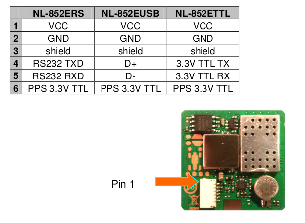
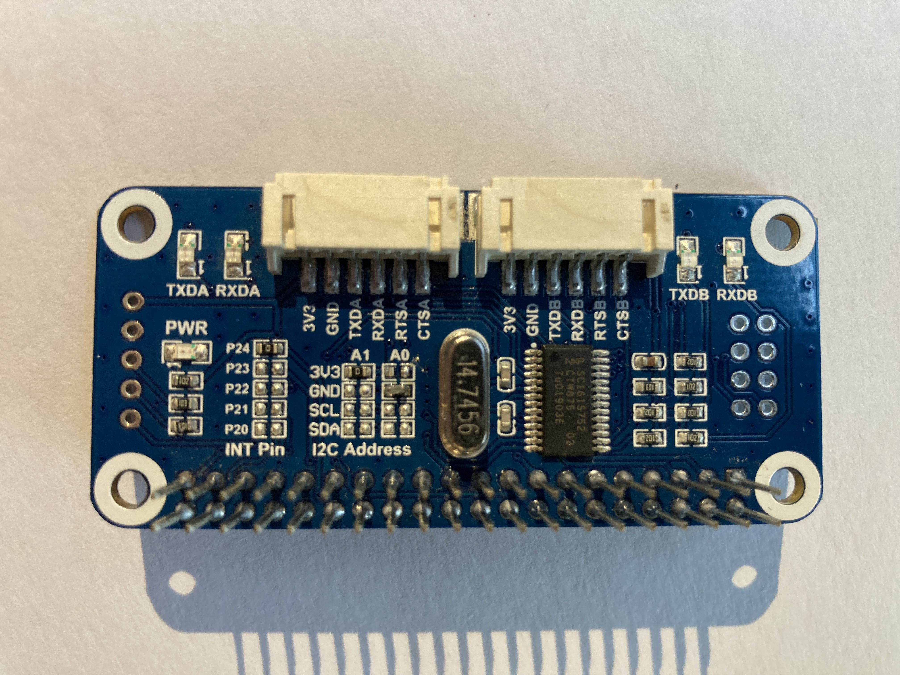
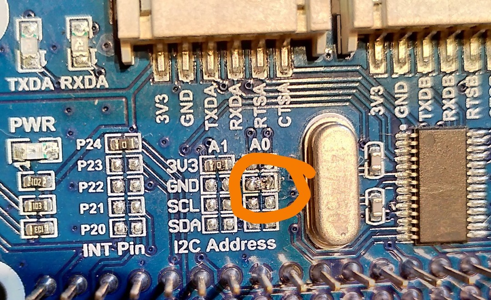
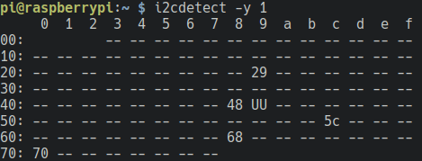

# Motion Sensor Box


## Overview

The __Motion Sensor Box__ is a simple, open-source sensor box available under the CC BY-SA 4.0 license. The sensor box is based on a Raspberry Pi Zero W and ships a variety of sensors as well as a number of interfaces to incorporate the sensor box into a huge variety of measurement projects. 

## Architecture

### Hardware
motion sensor box is build around a Raspberry Pi Zero and several external sensors.

The following lists the electronic components:

- [Raspberry Pi Zero W](https://www.raspberrypi.com/products/raspberry-pi-zero-w/)
- SD-Card
- [Waveshare Sense Hat](doc/waveshare_sense_hat/tldr_sense_hat.md)
- [Waveshare LoRa Hat](doc/waveshare_lora_hat/tldr_lora_hat.md)
- [Navilock GNSS-Reveiver](doc/Navilock_GNSS/tldr_navilock_gnss.md)
- [4.2 Inch E-Ink Display](doc/waveshare_e-ink_display/tldr_eink_display.md)
- e-Paper driver hat (board for the 4.2 inch display)
- [Raspberry Pi Camera V2.1](https://www.raspberrypi.com/documentation/accessories/camera.html)
- [Strom Pi 3](doc/strompi3/tldr_strompi.md)
- [LiFePO battery](doc/battery/README_BATTERY.md)

The mechanical structure consists of:
 - [Housing assembly](doc/housing/README_HOUSING.md)
 - A big 3D printed part that is used to position the components ("base plate")
 - Multiple smaller 3D printed parts
 - Two sheets that are laser cutted

 
## System Setup

motion sensor box runs the latest version of [Raspberry OS](https://www.raspberrypi.org/software/)

### Assembly

The following schematics shows how the external hardware is connected to the pi's header:


#### Assembly of the cabling

The GNSS sensor needs a custom made cable to connect it to the serial expansion board's JST 2.54 mm pin connector. 



The GNSS sensor's pins need to be connected to the corresponding pins of the serial expansion board.



#### Preparation of the electronics

The i2c address of the serial expansion board needs to be shifted (0x48 -> 0x49), such that it does not collide with an i2c address from the sense hat. To do so, remove the resistor at 3v3 and A0 and move it to GND A0 (see photo).



Afterwards run `i2cdetect -y 1` to see all available i2c devices. `0x49` (UU) is the i2c serial expansion board address. 



The pps pin from the gps module has to be connected to pin 13 (see [pinout.png](./YASB_pinout.png) for details).

Sense hat's long pins must be removed: Use a screw driver to lift the yellow part and then cut the pins.


#### Assembly of the electronics

Assembly from top to bottom:
 - e-paper driver hat (Display driver)
 - Sense hat
 - Breadboard
 - Extension plug
 - LoRa
 - StromPi
 - Raspberry Pi Zero W V1.1


### Software

Before configuring the Box, please make sure you checked out the git repository:

```bash
git clone git@github.com:flucto-gmbh/motion-sensor-box --recursive
```

The software is developed with simplicity in mind. SystemD and Unix-Architecture and tools are used whereever possible. For each specific task - for instance: gathering acceleration measurements from the ICM-20948 sensor, a simple python script is provided. This script is then installed as a service using systemd. This allows for managing the script via OS tools. 
Each script has been written such that no direct dependence on any other script is present. Only data is shared between yasb scripts, allowing for graceful failure in case anything goes wrong. 
To exchange data between scripts, unix fifos are used.

Checkout [System Setup](doc/system-setup.md) for details.

Details to internal data formats can be found in [motion sensor box Datastructures](doc/yasb-data.md)

## Sensing

### Waveshare's SenseHat

To provide a good basis for measurements, motion sensor box includes Waveshare's [SenseHat](https://www.waveshare.com/wiki/Sense_HAT_(B)).
A TL;DR regarding the senseHat for motion sensor box can be found under [doc/waveshare_sense_hat/tldr_sense_hat](doc/waveshare_sense_hat/tldr_sense_hat.md).

It packs a number of sensors, all connecting to a Raspberry Pi via I2C: 
- Integrated 9 DoF Motion Sensor: TDK's InvenSense [ICM-20938](https://invensense.tdk.com/products/motion-tracking/9-axis/icm-20948/). Quick facts regarding the most important information for motion sensor box can be found [here](doc/waveshare_sense_hat/ICM-20948.md). Device address: 0x68
- An analog-digital converter with 12 bit resolution and an extra set of I2C pins (ADS1015). Details can be found [here](doc/waveshare_sense_hat/ADS2015.md). Device address: 0x48
- Barometric pressure sensor with integrated temperature correction (LPS22HB). Details for motion sensor box can be found [here](doc/waveshare_sense_hat/LPS22HB.md). Device address: 0x5C
- A specific temperature & humidity sensor (SHTC3). Details for motion sensor box can be found [here](doc/waveshare_sense_hat/SHTC3.md). Device address: 0x70
- A color and ambient light sensor (TC34725). Details for motion sensor box can be found [here](doc/waveshare_sense_hat/TC34725.md). Device address: 0x29

### Camera

An official Raspberry Pi PiCam Noir (v2) is planned. It will allow low resolution live streams or high resolution imaging at fixed intervals. 

### GNSS

motion sensor box features a Navilock NL-852ETTL GNSS receiver. This modern GNSS receiver is based on the ublox8 chipset. It allows to receive navigation signal from any two GNSS systems simultaneously. The Chip supports all currently available GNSS Systems. 

### Additional Interfaces

Four analog inputs are available via the SenseHat. Additionally, I2C piuns are also exposed, allowing for easy connection to other embedded devices. For more high level applications, three USB-A port are available, allowing additional devices, such as cameras or network interfaces. 

## History of motion sensor box

The original motion sensor box was jointly developed by Uni Bremen and Flucto GmbH. 
Its development was inspired by a sensor box that was designed for a research project by Uni Bremen's Institute for Integrated Product Development (BIK) where measurements during the installation of "Trianel Windpark Borkum" were conducted.


