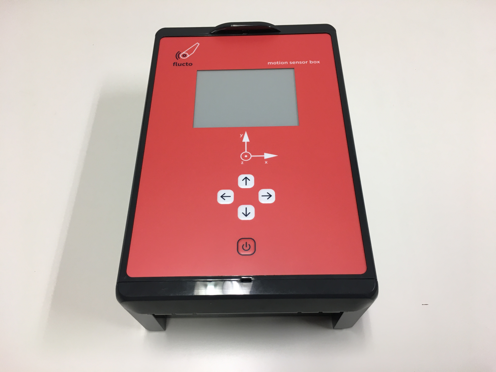
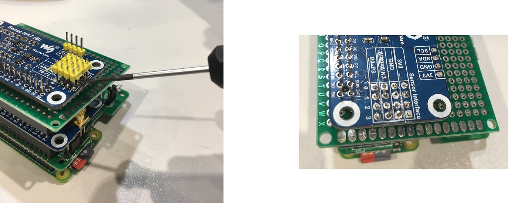
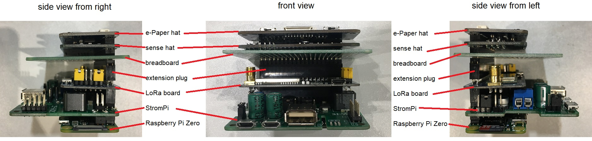
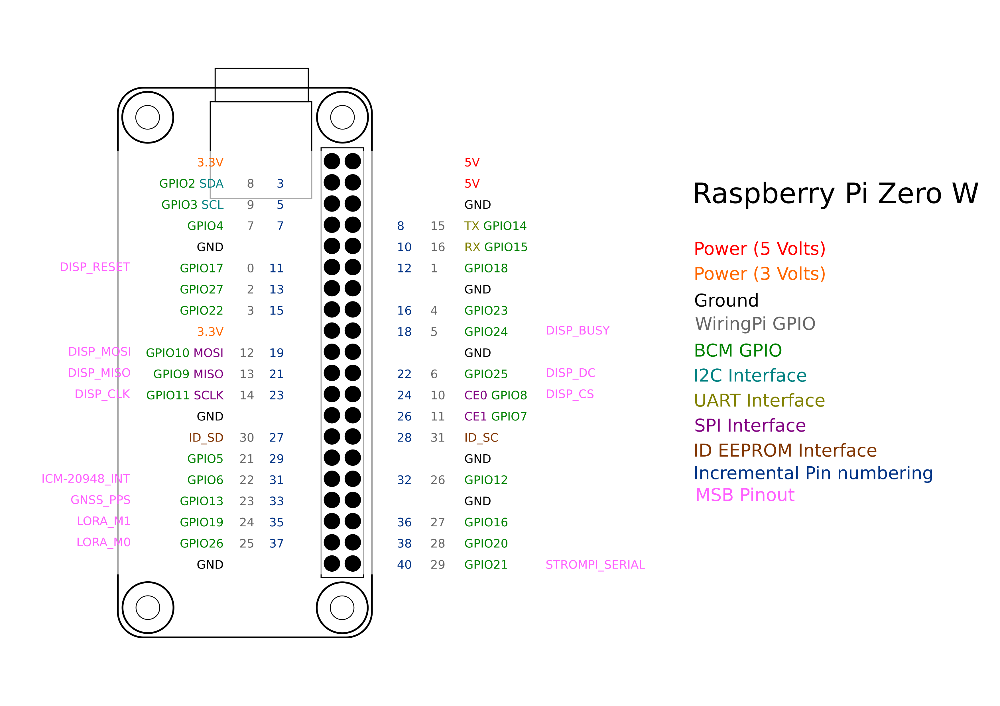

# Motion Sensor Box



## Overview

The __Motion Sensor Box__ is a simple, open-source sensor box available under the CC BY-SA 4.0 license. The sensor box is based on a Raspberry Pi Zero W and ships a variety of sensors as well as a number of interfaces to incorporate the sensor box into a huge variety of measurement projects. 

## Architecture

### Hardware
motion sensor box is build around a Raspberry Pi Zero and several external sensors.

The following lists the electronic components:

- [Raspberry Pi Zero W](https://www.raspberrypi.com/products/raspberry-pi-zero-w/)
- SD-Card
- [Waveshare Sense Hat](doc/waveshare_sense_hat/tldr_sense_hat.md)
- [Waveshare LoRa Hat](doc/waveshare_lora_hat/tldr_lora_hat.md)
- [Navilock GNSS-Reveiver](doc/Navilock_GNSS/tldr_navilock_gnss.md)
- [4.2 Inch E-Ink Display](doc/waveshare_e-ink_display/tldr_eink_display.md)
- e-Paper driver hat (board for the 4.2 inch display)
- [Raspberry Pi Camera V2.1](https://www.raspberrypi.com/documentation/accessories/camera.html)
- [Strom Pi 3](doc/strompi3/tldr_strompi.md)
- [LiFePO battery](doc/battery/README_BATTERY.md)

The mechanical structure consists of:
 - [Housing assembly](doc/housing/README_HOUSING.md)
 - A big 3D printed part that is used to position the components ("base plate")
 - Multiple smaller 3D printed parts
 - Two sheets that are laser cut

### Software

The software needed to run the motion sensor box is subdivided into a number of systemd service units. The reasoning behind this architecture is the following:

1. complexity: dissecting the software into pieces, each focusing on one single task allows for compartmentalization of the overall complexity
2. robustness: implementing each task as single service that communicates with the broker will increase overall robustness. If a service fails, it will (hopefully) not impair other services (except for the ones directly depending on the failed service)
3. extensibility: adding or removing a serivce is much easier

All interprocess communication between services is implemented using [zeroMQ](https://zeromq.org/)


#### List of Services

- **msb-imu.service:** manages the inertial measurement uni present on the sense hat. For more documentation, please see [doc/waveshare_sense_hat/ICM-20948.md](doc/waveshare_sense_hat/ICM-20948.md). Code is located at [src/imu](src/imu)
- **msb-gps.service:** samples gnss data from `gpsd`'s socket and provides it to other motion sensor box services. Further documentation is available [here](doc/gpsd/gpds.md). Code is located at [src/gps](src/gps)
- **msb-broker.service:** Creates and manages the publisher/subscriber model of motion sensor box services. code is located at [src/broker](src/broker)
- **msb-fusionlog.service:** Subscribes to **all** available data and logs it to a specified location on disc (default is $HOME/msb_data). source is located at [src/fusionlog](src/fusionlog)
- **msb-adc.service:** reads data from the analog-digital-converters and sends them to the broker service. Not implemented yet.
- **msb-attitude.service:** Uses the inertial measurement data from to estimate the orientation of a motion sensor box in space (reltative to the gravitation vector). Source available under [src/attitude](src/attitude)
- **msb-camera.service:** Manages the pi cam installed in the motion sensor boxes. Not implemented yet
- **msb-env.service:** Reads the environmental sensors in the motion sensor box and publishes them on the broker. Not implemented yet.
- **msb-lora.service:** Sends attitude information to the base station via lora. Sources at [msb/lora](msb/lora)
- **msb-wifi.service:** Sends all available data from the broker to the base station (or any other ip address) via UDP. Source at [src/wifi](src/wifi)
- **msb-power.service:** Manages power on the motion sensor boxes (shutdown, boot). Not implemented yet


#### Data structure for interprocess-communication

Each process must provide its data in the form of a pickled list via the zmq protocol.
The first three elements of the list are set to be a timezone aware datetime object,
the actual epoch and the uptime. The rest of the elements are left for whatever payload. 

As an example, the data structure from the imu service is shown. Please note, that
the number of elements in the list must match the element names, defined in the
[motion sensor box config file](config/msb.conf)


```python
import datetime
import uptime
import time
# inertial measurement unit
[ 
  datetime.datetime.fromtimestamp(ts := time.time(), tz=datetime.timezone.utc),
  ts,
  uptime.uptime(),
  acc_x,
  acc_y,
  acc_z,
  rot_x,
  rot_y,
  rot_z,
  mag_x,
  mag_y,
  mag_z,
  temp,
]
```
The data is serialized using pickles and send as a multipart-message onto the zmq bus.
To identify the data in other services, each serialized data package is designated with a 
topic string. Here is a list of the topic strings used by the motion sensor box software:
- msb-imu.service: `imu`
- msb-gps.serivce: `gps`
- msb-power.service: `pwr`
- msb-attitude.serivce: `att`
- msb-adc.serivce: `adc`
- msb-ldr.service: `ldr`


## Setup

motion sensor box runs the latest version of [Raspberry OS](https://www.raspberrypi.org/software/)

### Hardware assembly

Two sub assemblies need to be prepared before general assembly starts

 - Housing's lid (not yet documented)
 - Electronics stack (see "Assembly of electronics" below)

After the subassemblies have been prepared general assembly can start:

1) Mount the camera glass
2) Mount the round camera holder
3) Mount the camera on the camera holder
4) Mount the four Distanzbolzen
5) Insert the camera cable into the base plate's camera canal
6) Mount the base plate by fixing it with two M3x8 screws
7) Connect the camera with the camera cable
8) Insert the hammer head screw into the base plate and fix it using a M6 nut
9) Insert the battery into the base plate's battery compartment
10) Mount the battery lid using four M3x12 screws
11) To be continued: integration of the electronics stack 

### Assembly of electronics

#### Preparation of the electronics

1) Use Raspberry Pi Imager to flash the SD card with Raspberry Pi OS lite. Reinsert the SD card afterwards.

2) open the partition named rootfs and from the motion sensor box github repository copy the following files (on linux):

```bash
sudo cp /path-to-motion-sensor-box-repository/cfg/hosts /path-to-SD/rootfs/etc
sudo cp /path-to-motion-sensor-box-repository/cfg/hostname /path-to-SD/rootfs/etc
sudo cp /path-to-motion-sensor-box-repository/cfg/rtunnel.service /path-to-SD/rootfs/etc/systemd/system

sudo cp /path-to-motion-sensor-box-repository/cfg/wpa_supplicant.conf /path-to-SD/boot
```
3) in the boot partition, create an empty file called `ssh` to enable ssh login:

```bash
touch /path-to-SD/boot/ssh
```

4) afterwards, please open the file `/path-to-SD/rootfs/etc/hostname` and `/path-to-SD/Arootfs/etc/hosts` and edit the serial number of the motion sensor box to the corresponding value

5) open the file `/path-to-SD/rootfs/etc/systemd/system/rtunnel.service` and repalce '[REMOTE PORT]' to 65000 + the erial number, e.g. 0014 (65000 + 0014  = 65014)

6) Sense hat's long pins must be removed: Use a screw driver to lift the yellow part and then cut the pins.



7) Prepare the cables (see [cable documentation](doc/cables))

#### Electronics Assembly

Assemble the stack starting from the bottom to the top:
 - Raspberry Pi Zero W V1.1
 - StromPi
 - LoRa
 - Extension plug
 - Breadboard
 - Sense hat
 - e-paper driver hat (Display driver)
 




The following schematics shows how the external hardware is connected to the pi's header:



### Software Setup

Connect the Electronics to power, either through a dedicated USB cable or through the Bulgin power connector. Wait 30 s for the raspberry pi to boot.

Login to the box using SSH (replace XXX with the last 3 digits of the serial number and "location-of-key-on-local-machine"):
```bash
ssh pi@flucto.tech -p 65XXX -i "location-of-key-on-local-machine"
```

Alternatively, if you are in the same WLAN you can login locally (replace XXX with the last 3 digits of the serial number):
```bash
ssh pi@msb-0XXX-a.local -i "location-of-key-on-local-machine"
```

Install git:

```bash
sudo apt-get update
sudo apt-get install git
```

Then clone the git repository to the box' `home/pi` folder:

```bash
git clone https://github.com/flucto-gmbh/motion-sensor-box.git --recursive
```

To finish the setup, please follow through with [system Setup](doc/system-setup.md).

### Software debugging

To access a motion sensor box via a bluetooth serial console, follow [these steps](doc/bluetooth_shell.md)

## Sensing

### Waveshare's SenseHat

To provide a good basis for measurements, motion sensor box includes Waveshare's [SenseHat](https://www.waveshare.com/wiki/Sense_HAT_(B)).
A TL;DR regarding the senseHat for motion sensor box can be found under [doc/waveshare_sense_hat/tldr_sense_hat](doc/waveshare_sense_hat/tldr_sense_hat.md).

It packs a number of sensors, all connecting to a Raspberry Pi via I2C: 
- Integrated 9 DoF Motion Sensor: TDK's InvenSense [ICM-20938](https://invensense.tdk.com/products/motion-tracking/9-axis/icm-20948/). Quick facts regarding the most important information for motion sensor box can be found [here](doc/waveshare_sense_hat/ICM-20948.md). Device address: 0x68
- An analog-digital converter with 12 bit resolution and an extra set of I2C pins (ADS1015). Details can be found [here](doc/waveshare_sense_hat/ADS2015.md). Device address: 0x48
- Barometric pressure sensor with integrated temperature correction (LPS22HB). Details for motion sensor box can be found [here](doc/waveshare_sense_hat/LPS22HB.md). Device address: 0x5C
- A specific temperature & humidity sensor (SHTC3). Details for motion sensor box can be found [here](doc/waveshare_sense_hat/SHTC3.md). Device address: 0x70
- A color and ambient light sensor (TC34725). Details for motion sensor box can be found [here](doc/waveshare_sense_hat/TC34725.md). Device address: 0x29

### Camera

An official Raspberry Pi PiCam Noir (v2) is planned. It will allow low resolution live streams or high resolution imaging at fixed intervals. 

### GNSS

motion sensor box features a Navilock NL-852ETTL GNSS receiver. This modern GNSS receiver is based on the ublox8 chipset. It allows to receive navigation signal from any two GNSS systems simultaneously. The Chip supports all currently available GNSS Systems. 

### Additional Interfaces

Four analog inputs are available via the SenseHat. Additionally, I2C piuns are also exposed, allowing for easy connection to other embedded devices. For more high level applications, three USB-A port are available, allowing additional devices, such as cameras or network interfaces. 

## History of motion sensor box

The original motion sensor box was jointly developed by Uni Bremen and Flucto GmbH. 
Its development was inspired by a sensor box that was designed for a research project by Uni Bremen's Institute for Integrated Product Development (BIK) where measurements during the installation of "Trianel Windpark Borkum" were conducted.


