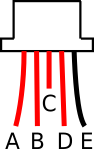

# Preparing cables

## Power cable
Image 56: Power cable (Sicherung missing)

Image 57: Combine + and - power cable

Image 58: Assembly of power cable in box

## Inside cybercube power cable
Image 63

## Power switch cable
Image 45: Solder to StromPi (and bread board)

Image 72: Cable on StromPi

Image 73: Cable on breadboard

## USB-GNSS cable
How it should look like in the end: Image 62_fullresolution

Use the following table for soldering the Usb cable to the GNSS-cable with the JST-style GNSS cable: 

|GNSS side   | A     | B     | C   | D     | E    | 
|---         | :---: |:---:  |:---:|:---:  |:---: | 
|USB side    | white | green |*cut*| black | red  |

### GNSS Cable colours

USB side: Image 60

GNSS side: Image 61

