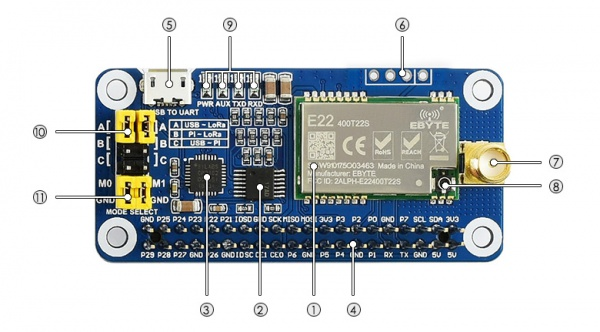
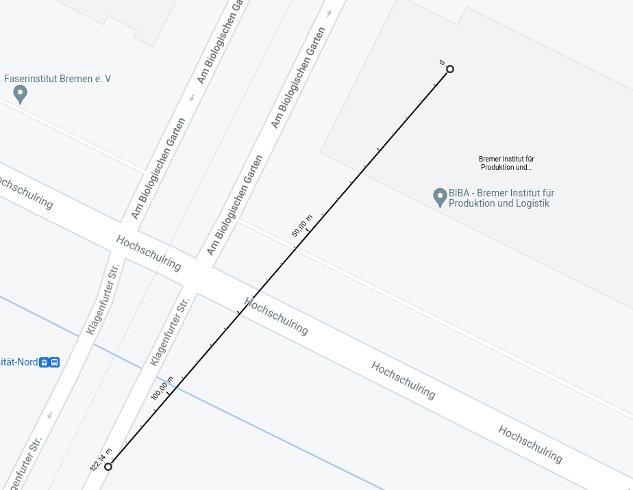
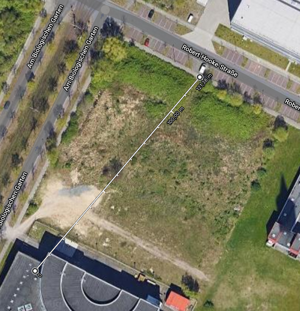
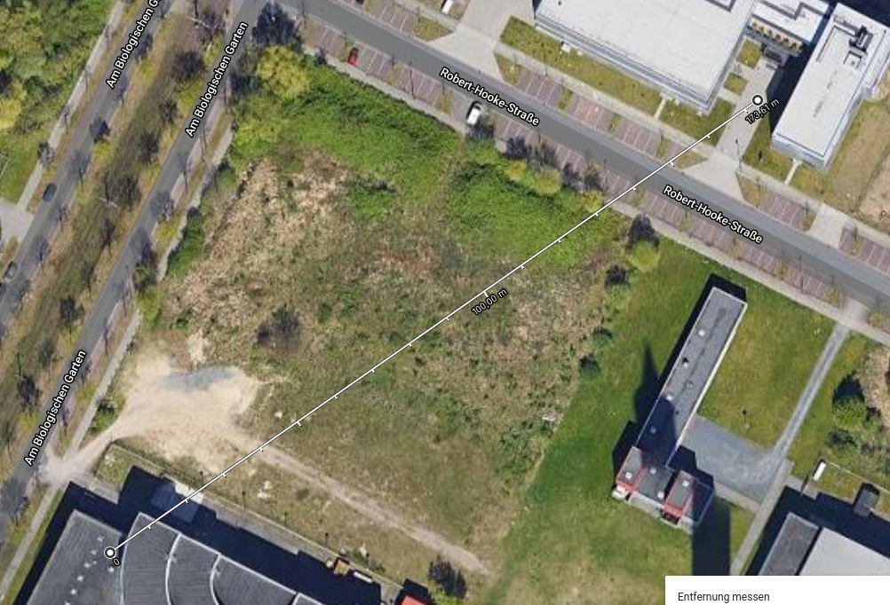
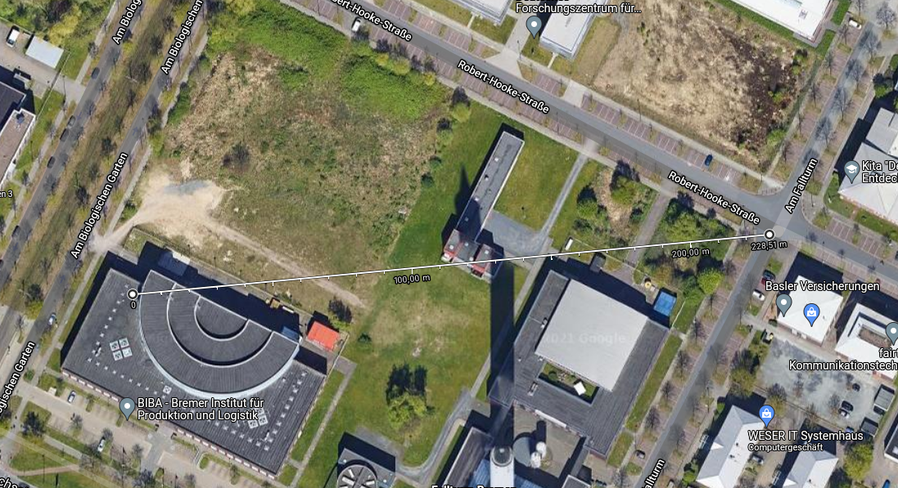
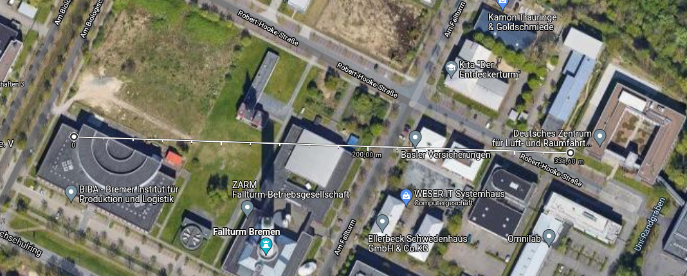
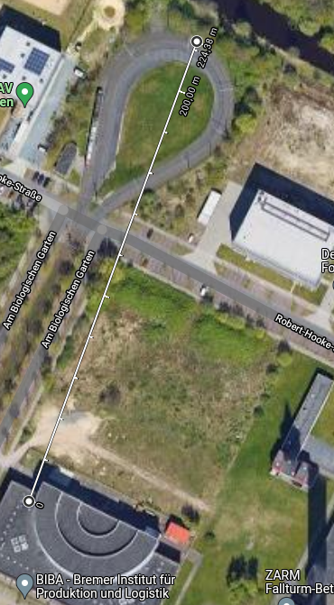
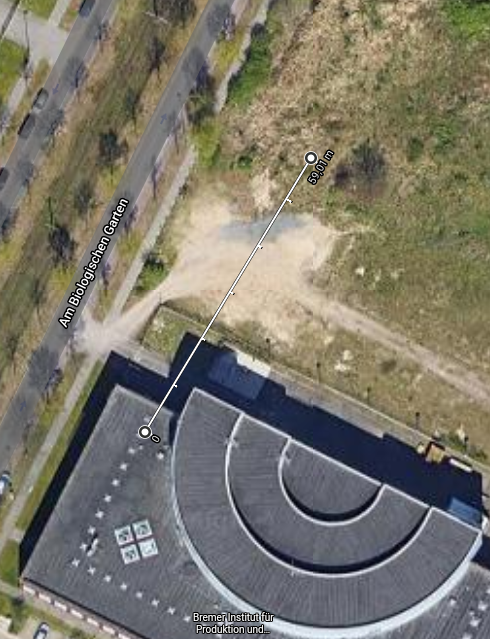

# Report on the implementation of a LoRa driver for the motion-sensor-box
## Regulations

- https://lora.readthedocs.io/en/latest/
- https://www.thethingsnetwork.org/docs/lorawan/frequencies-by-country/ ⇒ Taiwan: AS923-925 (“AS2”)
- http://www.rootlaw.com.tw/Attach/L-Doc/A040110071000200-1050823-1000-001.pdf

# Used Hardware
- SX1262 915M LoRa HAT 
    - **wiki**: https://www.waveshare.com/wiki/SX1262_915M_LoRa_HAT (lots of the following information is copied directly from this wiki)





* UART selection jumpers (10)
    * A: control the LoRa module through USB TO UART
    * B: control the LoRa module through Raspberry Pi
    * C: access Raspberry Pi through USB TO UART
⇒ Move the yellow pins(jumpers) in Position B. 

* LoRa mode selection jumpers (11)
    * short M0, short M1: transmission mode -> 00 -> Mode 0
    * short M0, open M1: configuration mode ->10 -> Mode 2
    * open M0, short M1: WOR mode (WOR = Wake on Radio)? -> 01 -> Mode 1
    * open M0, open M1: deep sleep mode -> 11 -> Mode 3

*comment: The wiki does not explain which mode gets which number, I inferred this interpreting M0 and M1 as binary numbers*

* Mode 0: Transmission mode, Module transmit data when users send data to UART interface. Wireless receiving is enabled to receive data and send to UART interface when idle.
* Mode 1:When it is defined to Transmit, user need to add wakeup codes before transmitting, receiving is same as Mode 0.
* Mode 2: Wireless transmit and wireless receive are disabled, users can configure configuration according to [#Registers Configuration](https://www.waveshare.com/wiki/SX1268_433M_LoRa_HAT#Registers_Configuration)
* Mode 3: Wireless transmit and wireless receive are disabled, module enter deep sleep mode. Module will configure when switching to other modes.

* Install the antenna (7 or 8)

## Setup OS
1. Install raspberry pi os as described in motion sensor box repo
2. Enable serial port:
    - Run command **sudo raspi-config** to open Configure interface 
    - Choose Interface Options -> Serial Port 
        - Would you like a login shell to be accessible over serial? ⇒  No 
        - Would you like the serial port hardware to be enabled? ⇒  Yes
    - https://raspberrypi.stackexchange.com/a/45571
    - use /dev/serial0 (maps to /dev/ttyS0 ⇒  mini UART)
- 3. The following libraries should be installed:
    ```bash
    sudo apt update
    sudo apt upgrade
    sudo apt install python3-pip 
    sudo apt install python3-smbus
    sudo apt install python3-serial
    ```
    
## Software

Waveshare provides some example code:
```bash
wget https://www.waveshare.com/w/upload/6/68/SX126X\_LoRa\_HAT_Code.zip
unzip SX126X\_LoRa\_HAT_Code.zip
```

## Command formats:
The LoRa hat will be configured using the Raspberry's serial port. Before configuring make sure the hat is set to Configuration Mode (Mode 2; M0:low, M1:high).
The following command formats are supported:

- **Configure registers** : 0xC0 + Begin address + Length + Data (Answer: 0xC1 + Begin address + Length + Data)
- **Read registers**: 0xC1 + Begin address + Length (Answer: 0xC1 + Begin address + Length + Data)
- **Configure temporary registers**: 0xC2 + Begin address + Length + Data (Answer: 0xC1 + Begin address + Length + Data)
- **Wireless configuration**: 0xCF 0xCF + Common command (Answer: 0xCD 0xCF + Common answer)
We only use **Configure temporary registers**.

## Register/Settings description

see  register_table.html for a full view of the following table

<div class="aside">
<style type="text/css">
.tg  {border-collapse:collapse;border-spacing:0;}
.tg td{border-color:black;border-style:solid;border-width:1px;font-family:Arial, sans-serif;font-size:14px;
  overflow:hidden;padding:10px 5px;word-break:normal;}
.tg th{border-color:black;border-style:solid;border-width:1px;font-family:Arial, sans-serif;font-size:14px;
  font-weight:normal;overflow:hidden;padding:10px 5px;word-break:normal;}
.tg .tg-cly1{text-align:left;vertical-align:middle}
.tg .tg-9wq8{border-color:inherit;text-align:center;vertical-align:middle}
.tg .tg-mzvv{background-color:#808080;border-color:inherit;color:#FFF;text-align:center;vertical-align:middle}
.tg .tg-1pye{color:#000000;font-weight:bold;text-align:center;vertical-align:top}
.tg .tg-vpkt{border-color:inherit;color:#000000;font-weight:bold;text-align:center;vertical-align:top}
.tg .tg-0lax{text-align:left;vertical-align:top}
</style>
<table class="tg">
<thead>
  <tr>
    <th class="tg-vpkt">NO.</th>
    <th class="tg-vpkt">Read/Write</th>
    <th class="tg-vpkt">Name </th>
    <th class="tg-vpkt" colspan="4">Description </th>
    <th class="tg-vpkt">Note </th>
    <th class="tg-1pye">Driver Config Option </th>
  </tr>
</thead>
<tbody>
  <tr>
    <td class="tg-9wq8">00H</td>
    <td class="tg-9wq8">R/W</td>
    <td class="tg-9wq8">ADDH </td>
    <td class="tg-9wq8" colspan="4">ADDH (Default:0) </td>
    <td class="tg-9wq8" rowspan="2">High bits and Low bits of module address. Note thant when module address is 0xFFFF.<br> <br>It works as broadcasting and listening address and LoRa module doesn't filter address anymore&nbsp;&nbsp;</td>
    <td class="tg-cly1" rowspan="2">module_address</td>
  </tr>
  <tr>
    <td class="tg-9wq8">01H</td>
    <td class="tg-9wq8">R/W</td>
    <td class="tg-9wq8">ADDL </td>
    <td class="tg-9wq8" colspan="4">ADDL (Default:0) </td>
  </tr>
  <tr>
    <td class="tg-9wq8">02H</td>
    <td class="tg-9wq8">R/W</td>
    <td class="tg-9wq8">NETID </td>
    <td class="tg-9wq8" colspan="4">NETID (Default: 0)</td>
    <td class="tg-9wq8">Network ID, it is used to distinguish network. <br> <br>If you want to communicating between two modules, you need to set their NETID to same ID&nbsp;&nbsp;</td>
    <td class="tg-cly1">net_id</td>
  </tr>
  <tr>
    <td class="tg-9wq8" rowspan="23">03H </td>
    <td class="tg-9wq8" rowspan="23">R/W </td>
    <td class="tg-9wq8" rowspan="23">REG0 </td>
    <td class="tg-mzvv"><span style="color:white;background-color:grey">Bit 7 </span></td>
    <td class="tg-mzvv"><span style="color:white;background-color:grey">Bit 6 </span></td>
    <td class="tg-mzvv"><span style="color:white;background-color:grey">Bit 5 </span></td>
    <td class="tg-mzvv"><span style="color:white;background-color:grey">UART baud rate (bps) </span></td>
    <td class="tg-9wq8" rowspan="9">The baud rates and parity of modules which are intercommunicating can be different. <br> <br>Generally we recommend you to set their baud rate to same value to avoid data blocking or data losing&nbsp;&nbsp;</td>
    <td class="tg-cly1" rowspan="9">baud_rate</td>
  </tr>
  <tr>
    <td class="tg-9wq8">0 </td>
    <td class="tg-9wq8">0 </td>
    <td class="tg-9wq8">0</td>
    <td class="tg-9wq8">Baud rate is 1200 </td>
  </tr>
  <tr>
    <td class="tg-9wq8">0</td>
    <td class="tg-9wq8">0</td>
    <td class="tg-9wq8">1</td>
    <td class="tg-9wq8">Baud rate is 2400 </td>
  </tr>
  <tr>
    <td class="tg-9wq8">0</td>
    <td class="tg-9wq8">1</td>
    <td class="tg-9wq8">0</td>
    <td class="tg-9wq8">Baud rate is 4800 </td>
  </tr>
  <tr>
    <td class="tg-9wq8">0</td>
    <td class="tg-9wq8">1</td>
    <td class="tg-9wq8">1</td>
    <td class="tg-9wq8">Baud rate is 9600 (default) </td>
  </tr>
  <tr>
    <td class="tg-9wq8">1</td>
    <td class="tg-9wq8">0</td>
    <td class="tg-9wq8">0</td>
    <td class="tg-9wq8">Baud rate is 19200 </td>
  </tr>
  <tr>
    <td class="tg-9wq8">1</td>
    <td class="tg-9wq8">0</td>
    <td class="tg-9wq8">1</td>
    <td class="tg-9wq8">Baud rate is 38400 </td>
  </tr>
  <tr>
    <td class="tg-9wq8">1</td>
    <td class="tg-9wq8">1</td>
    <td class="tg-9wq8">0</td>
    <td class="tg-9wq8">Baud rate is 57600 </td>
  </tr>
  <tr>
    <td class="tg-9wq8">1</td>
    <td class="tg-9wq8">1</td>
    <td class="tg-9wq8">1</td>
    <td class="tg-9wq8">Baud rate is 115200 </td>
  </tr>
  <tr>
    <td class="tg-mzvv"><span style="color:white;background-color:grey">Bit 4 </span></td>
    <td class="tg-mzvv"><span style="color:white;background-color:grey"> Bit 3 </span></td>
    <td class="tg-mzvv" colspan="2"><span style="color:white;background-color:grey">Parity bit </span></td>
    <td class="tg-9wq8" rowspan="5">The serial port of modules which are intercommunicating can set to different paramters </td>
    <td class="tg-cly1" rowspan="5">parity_bit</td>
  </tr>
  <tr>
    <td class="tg-9wq8">0</td>
    <td class="tg-9wq8">0 </td>
    <td class="tg-9wq8" colspan="2">8N1 (Default) </td>
  </tr>
  <tr>
    <td class="tg-9wq8">0</td>
    <td class="tg-9wq8">1 </td>
    <td class="tg-9wq8" colspan="2">8O1 </td>
  </tr>
  <tr>
    <td class="tg-9wq8">1</td>
    <td class="tg-9wq8">0 </td>
    <td class="tg-9wq8" colspan="2">8E1 </td>
  </tr>
  <tr>
    <td class="tg-9wq8">1</td>
    <td class="tg-9wq8">1 </td>
    <td class="tg-9wq8" colspan="2">8N1 (same as 00) </td>
  </tr>
  <tr>
    <td class="tg-mzvv"><span style="color:white;background-color:grey">Bit 2 </span></td>
    <td class="tg-mzvv"><span style="color:white;background-color:grey">Bit 1 </span></td>
    <td class="tg-mzvv"><span style="color:white;background-color:grey">Bit 0 </span></td>
    <td class="tg-mzvv"><span style="color:white;background-color:grey">Wireless Air speed (bps) </span></td>
    <td class="tg-9wq8" rowspan="9">The air speed of two modules which are intercommunicating must be same. <br> <br>Higher the speed, smaller the latency and shorter the communicating distance.&nbsp;&nbsp;</td>
    <td class="tg-cly1" rowspan="9">air_speed</td>
  </tr>
  <tr>
    <td class="tg-9wq8">0</td>
    <td class="tg-9wq8">0</td>
    <td class="tg-9wq8">0</td>
    <td class="tg-9wq8">Air speed is 0.3K </td>
  </tr>
  <tr>
    <td class="tg-9wq8">0</td>
    <td class="tg-9wq8">0</td>
    <td class="tg-9wq8">1</td>
    <td class="tg-9wq8">Air speed is 1.2K </td>
  </tr>
  <tr>
    <td class="tg-9wq8">0</td>
    <td class="tg-9wq8">1</td>
    <td class="tg-9wq8">0</td>
    <td class="tg-9wq8">Air speed is 2.4K (default) </td>
  </tr>
  <tr>
    <td class="tg-9wq8">0</td>
    <td class="tg-9wq8">1</td>
    <td class="tg-9wq8">1</td>
    <td class="tg-9wq8">Air speed is 4.8K (default) </td>
  </tr>
  <tr>
    <td class="tg-9wq8">1</td>
    <td class="tg-9wq8">0</td>
    <td class="tg-9wq8">0</td>
    <td class="tg-9wq8">Air speed is 9.6K </td>
  </tr>
  <tr>
    <td class="tg-9wq8">1</td>
    <td class="tg-9wq8">0</td>
    <td class="tg-9wq8">1</td>
    <td class="tg-9wq8">Air speed is 19.2K </td>
  </tr>
  <tr>
    <td class="tg-9wq8">1</td>
    <td class="tg-9wq8">1</td>
    <td class="tg-9wq8">0</td>
    <td class="tg-9wq8">Air speed is 38.4K </td>
  </tr>
  <tr>
    <td class="tg-9wq8">1</td>
    <td class="tg-9wq8">1</td>
    <td class="tg-9wq8">1</td>
    <td class="tg-9wq8">Air speed is 62.5K </td>
  </tr>
  <tr>
    <td class="tg-9wq8" rowspan="14">04H </td>
    <td class="tg-9wq8" rowspan="14">R/W </td>
    <td class="tg-9wq8" rowspan="14">REG1 </td>
    <td class="tg-mzvv"><span style="color:white;background-color:grey">Bit 7 </span></td>
    <td class="tg-mzvv"><span style="color:white;background-color:grey">Bit 6 </span></td>
    <td class="tg-mzvv" colspan="2"><span style="color:white;background-color:grey">Setting of dividing packet </span></td>
    <td class="tg-9wq8" rowspan="5">If the size of data transmitted are shorter than the length of divided packet. Data are continuous sent to serial port after receiving; <br> <br>If the size of data transmitted are longger than the length of divided packet. Data are divided and sent to serial port after receiving.&nbsp;&nbsp;</td>
    <td class="tg-cly1" rowspan="5">packet_len</td>
  </tr>
  <tr>
    <td class="tg-9wq8">0</td>
    <td class="tg-9wq8"> </td>
    <td class="tg-9wq8" colspan="2">240 bytes (default) </td>
  </tr>
  <tr>
    <td class="tg-9wq8">0</td>
    <td class="tg-9wq8">1 </td>
    <td class="tg-9wq8" colspan="2">128 bytes </td>
  </tr>
  <tr>
    <td class="tg-9wq8">1</td>
    <td class="tg-9wq8">0 </td>
    <td class="tg-9wq8" colspan="2">64 bytes </td>
  </tr>
  <tr>
    <td class="tg-9wq8">1</td>
    <td class="tg-9wq8">1 </td>
    <td class="tg-9wq8" colspan="2">32 bytes </td>
  </tr>
  <tr>
    <td class="tg-mzvv"><span style="color:white;background-color:grey">Bit 5 </span></td>
    <td class="tg-mzvv" colspan="3"><span style="color:white;background-color:grey">Enable ambient noise </span></td>
    <td class="tg-9wq8" rowspan="3">After enabling, You can send command 0xC0 0xC1 0xC2 0xC3 to read register in Transmit Mode or WOR Mode; <br> <br>Register 0x00: RSSI of current ambient noise <br> Register 0x01: The RSSI of last communicating (current noise of channel is dBm = - RSSI/2); <br> Command format: 0xC0 0xC1 0xC2 0xC3 + Begin address + Read length;<br> Answer format: 0xC1 + Address + Read length + Data; <br> For example:<br> Command: 0xC0 0xC1 0xC2 0xC3 0x00 0x01 <br> Answer: 0xC1 0x00 0x01 RSSI (The address should begin from 0x00)&nbsp;&nbsp;</td>
    <td class="tg-cly1" rowspan="3">enable_ambient_noise</td>
  </tr>
  <tr>
    <td class="tg-9wq8">0 </td>
    <td class="tg-9wq8" colspan="3">Disable (default) </td>
  </tr>
  <tr>
    <td class="tg-9wq8">1 </td>
    <td class="tg-9wq8" colspan="3"> enable </td>
  </tr>
  <tr>
    <td class="tg-mzvv"><span style="color:white;background-color:grey">Bit 4 </span></td>
    <td class="tg-mzvv"><span style="color:white;background-color:grey">Bit 3 </span></td>
    <td class="tg-mzvv"><span style="color:white;background-color:grey">Bit 2 </span></td>
    <td class="tg-mzvv"><span style="color:white;background-color:grey">Reserved</span></td>
    <td class="tg-9wq8"> </td>
    <td class="tg-0lax"></td>
  </tr>
  <tr>
    <td class="tg-mzvv"><span style="color:white;background-color:grey">Bit 1 </span></td>
    <td class="tg-mzvv"><span style="color:white;background-color:grey">Bit 0 </span></td>
    <td class="tg-mzvv" colspan="2"><span style="color:white;background-color:grey">Transmit power </span></td>
    <td class="tg-9wq8" rowspan="5">The relationship between power and current is non-linear.<br> <br>If power is maximum, the power efficiency is highest. <br> Current will not small in the same proportion of power.&nbsp;&nbsp;</td>
    <td class="tg-cly1" rowspan="5">transmit_power</td>
  </tr>
  <tr>
    <td class="tg-9wq8">0</td>
    <td class="tg-9wq8">0 </td>
    <td class="tg-9wq8" colspan="2">22dBm (default) </td>
  </tr>
  <tr>
    <td class="tg-9wq8">0</td>
    <td class="tg-9wq8">1 </td>
    <td class="tg-9wq8" colspan="2">17dBm </td>
  </tr>
  <tr>
    <td class="tg-9wq8">1</td>
    <td class="tg-9wq8">0 </td>
    <td class="tg-9wq8" colspan="2">12dBm </td>
  </tr>
  <tr>
    <td class="tg-9wq8">1</td>
    <td class="tg-9wq8">1 </td>
    <td class="tg-9wq8" colspan="2">10dBm </td>
  </tr>
  <tr>
    <td class="tg-9wq8">05H</td>
    <td class="tg-9wq8">R/W</td>
    <td class="tg-9wq8">REG2 </td>
    <td class="tg-9wq8" colspan="4">Channel control (CH) 0-83. 84 channels in total </td>
    <td class="tg-9wq8">Actually frequency is 850.125 + CH *1MHz. Default 868.125MHz(SX1262),or 410.125 + CH *1MHz. Default 433.125MHz(SX1268) </td>
    <td class="tg-cly1">channel</td>
  </tr>
  <tr>
    <td class="tg-9wq8" rowspan="24">06H </td>
    <td class="tg-9wq8" rowspan="24">R/W </td>
    <td class="tg-9wq8" rowspan="24">REG3 </td>
    <td class="tg-mzvv"><span style="color:white;background-color:grey">Bit 7 </span></td>
    <td class="tg-mzvv" colspan="3"><span style="color:white;background-color:grey">Enable RSSI byte </span></td>
    <td class="tg-9wq8" rowspan="3">After enabling, data sent to serial port is added with a RSSI byte after receiving </td>
    <td class="tg-cly1" rowspan="3">enable_RSSI_byte</td>
  </tr>
  <tr>
    <td class="tg-9wq8">0 </td>
    <td class="tg-9wq8" colspan="3">Disable (default) </td>
  </tr>
  <tr>
    <td class="tg-9wq8">1 </td>
    <td class="tg-9wq8" colspan="3">Enable </td>
  </tr>
  <tr>
    <td class="tg-mzvv"><span style="color:white;background-color:grey">Bit 6 </span></td>
    <td class="tg-mzvv" colspan="3"><span style="color:white;background-color:grey">Transmitting mode </span></td>
    <td class="tg-9wq8" rowspan="3">When point to point transmitting, module will recognize the first three byte as Address High + Address Low + Channel. and wireless transmit it </td>
    <td class="tg-cly1" rowspan="3">enable_point_to_point_mode</td>
  </tr>
  <tr>
    <td class="tg-9wq8">0 </td>
    <td class="tg-9wq8" colspan="3">Transparent transmitting (default) </td>
  </tr>
  <tr>
    <td class="tg-9wq8">1 </td>
    <td class="tg-9wq8" colspan="3">Point to Point Transmitting </td>
  </tr>
  <tr>
    <td class="tg-mzvv"><span style="color:white;background-color:grey">Bit 5 </span></td>
    <td class="tg-mzvv" colspan="3"><span style="color:white;background-color:grey">Relay function </span></td>
    <td class="tg-9wq8" rowspan="3">If target address is not module itself, module will forward data; <br> <br>To avoid data echo, we recommend you to use this function in point to point mode, that is target address is different with source address&nbsp;&nbsp;</td>
    <td class="tg-cly1" rowspan="3">enable_relay_function</td>
  </tr>
  <tr>
    <td class="tg-9wq8">0 </td>
    <td class="tg-9wq8" colspan="3">Disable (default) </td>
  </tr>
  <tr>
    <td class="tg-9wq8">1 </td>
    <td class="tg-9wq8" colspan="3">Enable </td>
  </tr>
  <tr>
    <td class="tg-mzvv"><span style="color:white;background-color:grey">Bit 4 </span></td>
    <td class="tg-mzvv" colspan="3"><span style="color:white;background-color:grey">Enable LBT </span></td>
    <td class="tg-9wq8" rowspan="3">Module will listen before transmit wireless data.<br> <br>This function can be used to avoid interference, however, it also clause longer latency;<br> The MAX LBT time is 2s, after 2s, data is forced to transmit&nbsp;&nbsp;</td>
    <td class="tg-cly1" rowspan="3">enable_LBT</td>
  </tr>
  <tr>
    <td class="tg-9wq8">0 </td>
    <td class="tg-9wq8" colspan="3">Disable(default) </td>
  </tr>
  <tr>
    <td class="tg-9wq8">1 </td>
    <td class="tg-9wq8" colspan="3">Enable </td>
  </tr>
  <tr>
    <td class="tg-mzvv"><span style="color:white;background-color:grey">Bit 3 </span></td>
    <td class="tg-mzvv" colspan="3"><span style="color:white;background-color:grey">WOR Mode Tramsmit/Receive control </span></td>
    <td class="tg-9wq8" rowspan="3">This setting only work for Mode 1;<br> <br>Receiver waits for 1000ms after receive wirelesss data and forward,and then enter WOR mode again<br> User can send data to serial port and forward via wireless network during this interval,<br> Every serial byte will refresh this interval time (1000ms);<br> You much send the first byte in 1000ms.&nbsp;&nbsp;</td>
    <td class="tg-cly1" rowspan="3">WOR_mode</td>
  </tr>
  <tr>
    <td class="tg-9wq8">0 </td>
    <td class="tg-9wq8" colspan="3">WOR transmit (default) <br> <br>Module is enabled to receive/transmit, and wakeup code is added to transmitted data.&nbsp;&nbsp;</td>
  </tr>
  <tr>
    <td class="tg-9wq8">1 </td>
    <td class="tg-9wq8" colspan="3"> WOR Sender <br> <br>Module is disable to send data. Module is working in WOR listen mode. Consumption is reduced&nbsp;&nbsp;</td>
  </tr>
  <tr>
    <td class="tg-mzvv"><span style="color:white;background-color:grey">Bit 2 </span></td>
    <td class="tg-mzvv"><span style="color:white;background-color:grey">Bit 1 </span></td>
    <td class="tg-mzvv"><span style="color:white;background-color:grey">Bit 0 </span></td>
    <td class="tg-mzvv"><span style="color:white;background-color:grey">WOR Period </span></td>
    <td class="tg-9wq8" rowspan="9">This setting only work for Mode 1;<br> <br>Period is equal to T = (1 + WOR) * 500ms; MAX 4000ms, MIN 500ms<br> Longer the Period time of WOR listen, lower the average consumption, however, longer the latency <br> The settings of receiver and sender must be same.&nbsp;&nbsp;&nbsp;</td>
    <td class="tg-cly1" rowspan="9">WOR_period</td>
  </tr>
  <tr>
    <td class="tg-9wq8">0</td>
    <td class="tg-9wq8">0</td>
    <td class="tg-9wq8">0</td>
    <td class="tg-9wq8">500ms </td>
  </tr>
  <tr>
    <td class="tg-9wq8">0</td>
    <td class="tg-9wq8">0</td>
    <td class="tg-9wq8">1</td>
    <td class="tg-9wq8">1000ms </td>
  </tr>
  <tr>
    <td class="tg-9wq8">0</td>
    <td class="tg-9wq8">1</td>
    <td class="tg-9wq8">0</td>
    <td class="tg-9wq8">1500ms </td>
  </tr>
  <tr>
    <td class="tg-9wq8">0</td>
    <td class="tg-9wq8">1</td>
    <td class="tg-9wq8">1</td>
    <td class="tg-9wq8">2000ms </td>
  </tr>
  <tr>
    <td class="tg-9wq8">1</td>
    <td class="tg-9wq8">0</td>
    <td class="tg-9wq8">0</td>
    <td class="tg-9wq8">2500ms </td>
  </tr>
  <tr>
    <td class="tg-9wq8">1</td>
    <td class="tg-9wq8">0</td>
    <td class="tg-9wq8">1</td>
    <td class="tg-9wq8">3000ms </td>
  </tr>
  <tr>
    <td class="tg-9wq8">1</td>
    <td class="tg-9wq8">1</td>
    <td class="tg-9wq8">0</td>
    <td class="tg-9wq8">3500ms </td>
  </tr>
  <tr>
    <td class="tg-9wq8">1</td>
    <td class="tg-9wq8">1</td>
    <td class="tg-9wq8">1</td>
    <td class="tg-9wq8">4000ms </td>
  </tr>
  <tr>
    <td class="tg-9wq8">07H</td>
    <td class="tg-9wq8">W</td>
    <td class="tg-9wq8">CRYPT_H </td>
    <td class="tg-9wq8" colspan="4">High bytes of Key (default 0) </td>
    <td class="tg-9wq8" rowspan="2"> Only write enable, the read result always be 0; <br> <br>This key is used to encrypting to avoid wireless data intercepted by similar modules;<br> This key is work as calculation factor when module is encrypting wireless data.&nbsp;&nbsp;</td>
    <td class="tg-cly1" rowspan="2">key</td>
  </tr>
  <tr>
    <td class="tg-9wq8">08H</td>
    <td class="tg-9wq8">W</td>
    <td class="tg-9wq8">CRYPT_L </td>
    <td class="tg-9wq8" colspan="4">Low bytes of key (default 0) </td>
  </tr>
  <tr>
    <td class="tg-9wq8">80H ~ 86H</td>
    <td class="tg-9wq8">R</td>
    <td class="tg-9wq8">PID </td>
    <td class="tg-9wq8" colspan="4"> Information of module (7 bytes)</td>
    <td class="tg-9wq8"> 7 bytes data of module information </td>
    <td class="tg-0lax"></td>
  </tr>
</tbody>
</table>
</div>


## Software Architecture

- driver:
    - **driver.py**: The main driver. Contains the code to communicate with the LoRa hat and to apply configuration.
    - **message.py**: Contains the abstract Message class and derived classes. Messages are used to serialize and deserialize data send via LoRa.
    - **util.py**: Contains functions to read configuration bytes send to the LoRa hat. (Reverse of the apply_config in driver.py) Used for debugging only.
- send/receive:
    - **msb_lora.py**: The main script to run on the motion sensor box. Listens on zeroMQ for Attitude and GPS messages/data.Will send the most recent data every second. Will use one of 3 time slots in a second as defined in the config.
    - **basestation_lora.py**: The main script to run on the basestation. Will receive LoRa messages, and push dict's with data from that message to zeroMQ.
    - **sim_basestation_lora.py**: A simulation of basestation_lora.py that will send random data instead of listening via LoRa. For debugging purposes.
    - **sender.py** DEPRECATED, first attempt at sending messages via LoRa.
    - **receiver.py** DEPRECATED, first attempt at receiving messages via LoRa
- configuration
    - **config_lora.py**: Common configuration for the LoRa hat, common general configuration and the logging configuration. 
    - **config_msb.py**: Configuration specific for the motion-sensor-box (sender). Values in `lora_hat_config` will overwrite the common configuration. If the used boxes do not have 3 consecutive module id's the sender time slot has to be defined here manually.
    - **config_basestation.py**: Configuration specific to the basestation.  Values in `lora_hat_config` will overwrite the common configuration.
- basestation
    - **basestation_persist_lora.py**: Will listen on the basestations zeroMQ socket for "lor" messages and write the received dict's to disk. The data will be stored in     persist_lora/persist_lora.txt.>num< relative to the working directory, where >num< is number between 1 and 20 or "".


## Test

### Transmitting Distance
1. MSB 17, 18 und 19 senden Daten an die basetation in der BIBA Halle. Andreas geht mit den Boxen nach draußen. Er hält die 19 in der Hand,  und hat die 17 und 18 im Rucksack. 
    - Die Daten sind auf der Basetation in `first_lora_test` gespeichert.
    - 19 verliert einzelne Nachrichten  sobald das BIBA durch den Haupteingang verlassen wird. 
    - Am Schild in der Nähe vom BIAS werden Nachrichten von 19 wieder empfangen.



2. Sende alle 3 Sekunden eine Nachricht (3 Sender zeitversetzt) (Airspeed1.2K)
    - BIBA Eingang 19 wieder weg
    - am in Versuch 1 beschriebenen Schild alle keinen Empfang
    - am Anfang des Straßenbahn Wendekreis immer noch Empfang (Siehe Bild)
    - erste Sendeinbrüche von 17 durch Hecke
    - bei Heckenöffnung wieder Empfang (siehe Bild)
    - vor Eingang DFKI kommen alle 3 noch an (Bild)
    - Kreuzung Am Fallturm – Robert-Hooke-Straße kommen noch Nachrichten an (Bild)
    - Robert-Hooke-Straße 5 DFKI nur noch 19 kommt an (18 vereinzelt) (Bild)
    - auf dem Boden schlechter, einzeln hochheben -> alle wieder Empfang
    - jetzt 18, 19 in Rucksack, 17 in Hand
    - hinter ZARM Hauptgebäude kommen alle an
    - Auf dem Weg zum Wendekreis: 17 im laufen ausgefallen,  rest funktioniert 
    - Ende Wendekreis im Stehen kommen alle an (BILD)












3. Airspeed 2.4K, 4 slots auf 2 Sekunden verteilt
    - 19 hat eigene Sekunde, 17 und 18 teilen sich die andere Sekunde
    - Durch Hauptausgang Richtung Wendekreis: um BIBA herrum kein Empfang
    - durch Glaswand wieder Empfang
    - an Kreuzung zum DFKI, vereinzelte Aussetzer
    - Ende Wendekreis, 17 mit vielen Aussetzern, 18 und 19 relativ stabil
    - Im Stehen am Ende Wendekreises alle kommen an. (und dann haben doch wieder alle Aussetzer)
    - Allgemein: im Laufen viele Aussetzer
    - Öffnung in der Hecke, beim DFKI: nur 18 hat Empfang

4. wie 3. aber mit 1.2K Airspeed
- direkt durch Glastür raus
- 17 weg, and der Kreuzung, im Stehen wieder da
- Ende Wendekreis: alle kommen an, vereinzelte Aussetzer
- Straßenbahn verschlechert Empfang
- wieder zur Lücke in der Hecke, vereinzelt Aussetzer
- Parkplatz hinterm BIBA, alles kommt an (Bild)
- Auf den Boden gestellt (Photo Andreas)
- Trotz Box in Werkzeugkasten kommen Nachrichten an


